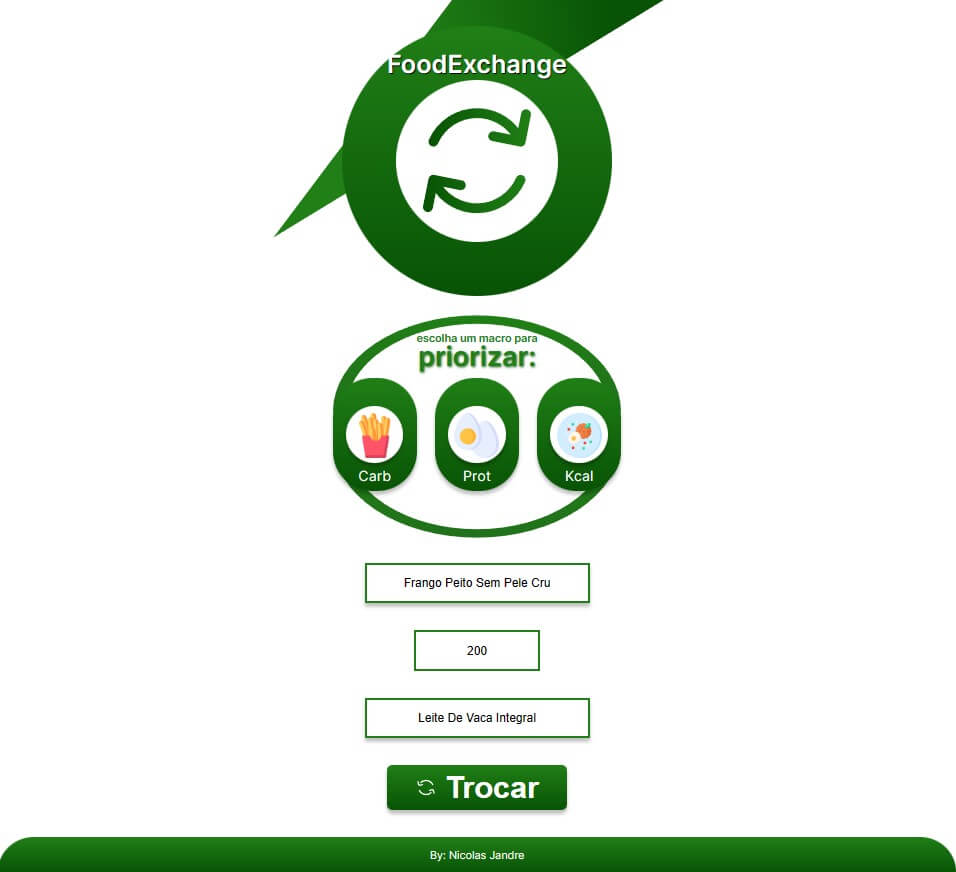

<h1 align="center">Food Exchange</h1>

É com muito prazer que te recebo na página do meu projeto! 

Esse, até o momento, é o meu favorito!
Cursei dois anos de nutrição e sempre fui adepto da dieta flexível, estilo dietético onde você troca um alimento predominante de carboidrato por outro, por exemplo, mantendo a mesma ingestão de carboidratos especificados pelo nutricionista porém sem se prender a somente uma refeição.

 

Este projeto veio pra resolver um problema que sempre tive: ter de consultar sites de tabela nutricional e, manualmente e um por um, consultar e recalcular quantas gramas de determinado alimento poderia comer em relação a outro.

Aqui resolvo esse problema! Escolha o primeiro alimento que deseja trocar por outro, as gramas do mesmo, o alimento que quer em troca e tenha ta tabela com os mais importantes macro-nutrientes de cada em sua mão. Você ainda tem a opção de decidir se deseja priorizar a conversão para bater a proteína, o carboidrato ou as calorias. Irado, não?!

Outro detalhe bacana que me fez AMAR produzir esse queridinho: eu quem fiz o UX. E particularmente, achei lindo!

Muito obrigado por visitar esta página e deixe seu fav. :)

 

Tecnologias utilizadas:
 HTML e CSS
 Javascript
 UI/UX Design
 Git e GitHub

<h2 align="center">JSON:<h2>

Esta JSON foi retirada do seguinte repositório: 
 <a href="https://github.com/raulfdm/taco-api">https://github.com/raulfdm/taco-api</a>
